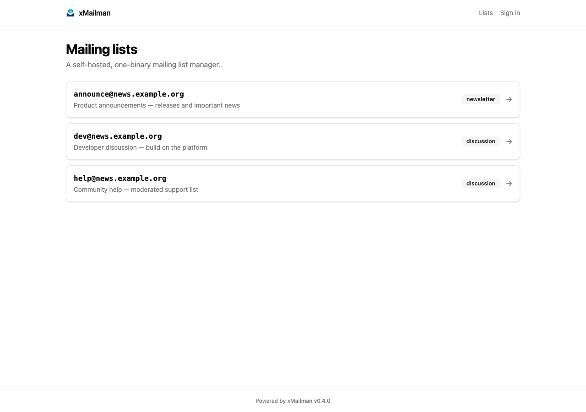
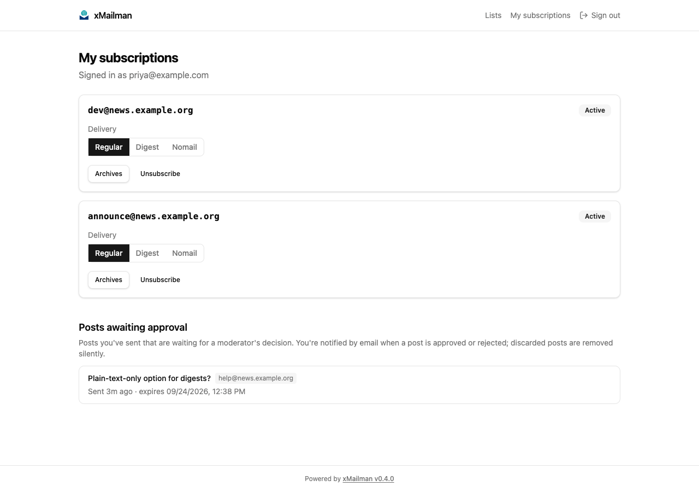
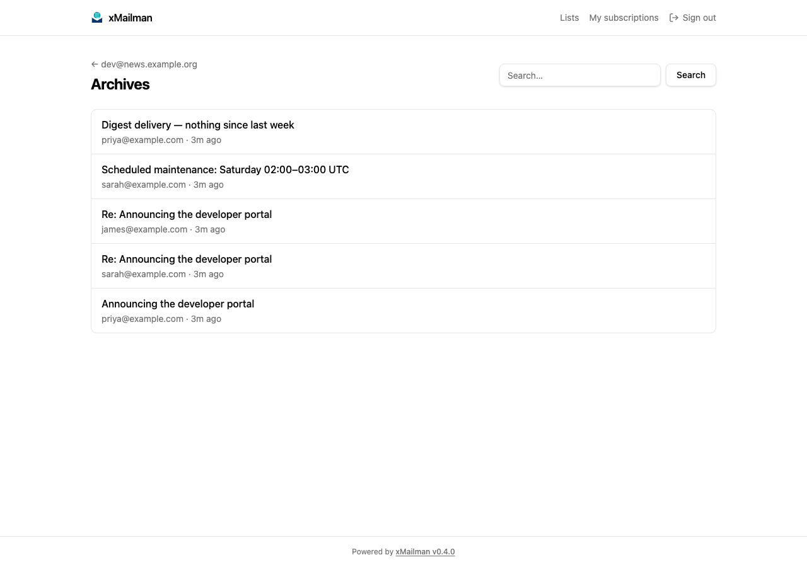
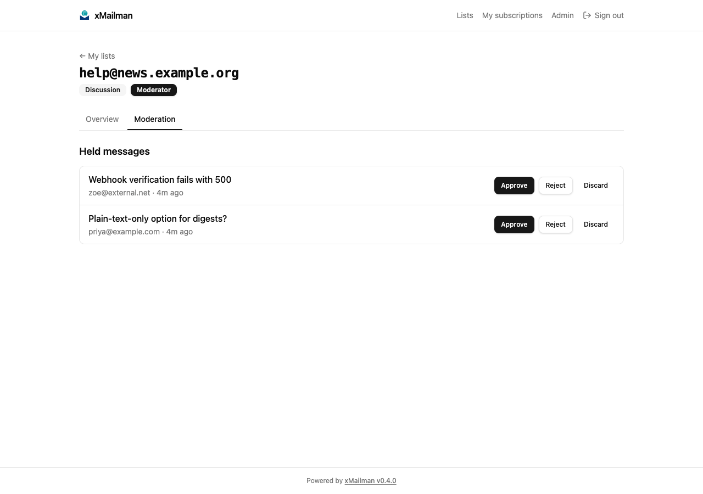
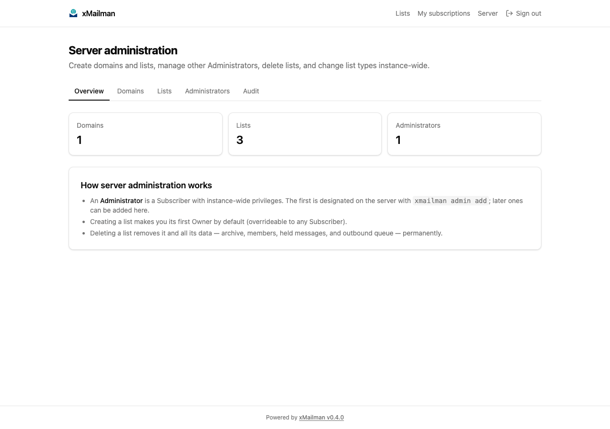

# xMailman

**A one-binary, self-hosted mailing list manager.** A modern, self-contained
alternative to GNU Mailman: manage mailing lists, subscriptions, archives, and
moderation from a passwordless web UI and a CLI, delivered as a single static
binary with an embedded frontend and SQLite storage.

- **One binary, no services.** Go daemon + embedded SvelteKit web UI + SQLite.
  Drop it on a VPS or run the container; no separate database, cache, or
  frontend server.
- **No passwords anywhere.** Sign-in is passwordless: one-time magic links
  emailed to the subscriber, backed by short-lived sessions.
- **MTA-native.** Receives mail over LMTP (Postfix and exim validated) or a
  pipe-mode socket; delivers outbound through a persistent, retrying queue.
- **Full lifecycle.** Double opt-in, four-state subscriptions, digests,
  VERP bounce tracking with auto-disable, held-message moderation, an
  immutable audit trail, CSV member import/export, and attachment policies.

## Screenshots

Captured from a live instance seeded with demo data — reproduce them with
`scripts/screenshot-seed.sh`. Click a thumbnail to open it full size.

<table>
  <tr>
    <td align="center"><a href="docs/screenshots/lists.png"></a><br/><em>Public list index</em></td>
    <td align="center"><a href="docs/screenshots/me.png"></a><br/><em>Member self-service</em></td>
    <td align="center"><a href="docs/screenshots/archives.png"></a><br/><em>Members-only archives</em></td>
    <td align="center"><a href="docs/screenshots/moderation.png"></a><br/><em>Moderation queue</em></td>
    <td align="center"><a href="docs/screenshots/server.png"></a><br/><em>Server administration</em></td>
  </tr>
</table>

## Features

**Mailing lists**
- Virtual domains hosting multiple lists; discussion and newsletter list types
- Email-driven workflows: `subscribe`, `confirm`, `post`, `unsubscribe`,
  bounce handling, and `-request` commands (`which`, `set digest`, …) — all by
  writing to `listname+role@domain`
- Double opt-in subscription confirmation; open / moderated / closed
  subscription policies
- Per-list settings: moderation, subject prefix, footer, digest frequency,
  reply-to mode, max message size, attachment policy, archive retention,
  and configurable welcome/goodbye/notice emails

**Moderation & roles**
- Held-message moderation (approve / reject / discard) from email, CLI, and web
- Roles: **Owner**, **Moderator**, **Designated Sender** (newsletter allowlist),
  and instance-wide **Administrator** — the web console surfaces what you can do
- Immutable audit trail of every privileged action, surfaced on the web and CLI

**Delivery**
- Persistent outbound queue with exponential backoff; posts bounce to the
  sender at max retries
- Daily or weekly digests (multipart/digest), compiled from the archive
- VERP envelope senders attribute bounces to the right subscription;
  auto-disable after a configurable threshold, with owner notification

**Web UI**
- Public: list index and info with subscribe forms
- Member self-service: manage subscriptions, delivery preference
  (regular / digest / nomail), re-enable, unsubscribe
- Members-only archives: threaded browsing, full-text search (SQLite FTS5),
  MIME-aware rendering with sanitized HTML and attachment downloads
- Per-list admin console (settings, members, roles, moderation, allowlist,
  bounces, audit) and a server-admin area (domains, lists, administrators)

**Operations**
- CLI parity for administration: `xmailman domain|list|owner|subscriber|…`
- YAML config with environment overrides and `${ENV_VAR}` secret expansion
- `systemd` unit and a multi-stage `scratch`-based Docker image included

## Quickstart

### Option 1 — Prebuilt binary download

Download the archive for your platform from
[GitHub Releases](https://github.com/barats/xmailman/releases) — for example
`xmailman_0.4.0_linux_amd64.tar.gz` (linux/darwin × amd64/arm64 are
available, plus `checksums.txt` to verify). The release binaries ship the web
UI embedded.

```sh
tar xzf xmailman_0.4.0_linux_amd64.tar.gz
./xmailman config init                 # generate ./xmailman.yaml, then edit it
./xmailman serve
```

### Option 2 — Docker / Podman

```sh
docker run -d --name xmailman \
  -p 8080:8080 -p 8024:8024 \
  -v xmailman-data:/data \
  -e XMAILMAN_WEB_BASE_URL=http://localhost:8080 \
  ghcr.io/barats/xmailman:0.4.0
```

The image ships a working default config (`/etc/xmailman/config.yaml`); any
value can be overridden with `XMAILMAN_*` environment variables (e.g. point
`XMAILMAN_SMTP_HOST` / `XMAILMAN_SMTP_PORT` at your relay). See
[Configuration](#configuration). Prefer Podman? Substitute `podman` for
`docker` in the command above.

### Option 3 — Build from source

Prerequisites: Go 1.25+, and Node.js + pnpm for the embedded web UI.

```sh
cd web && pnpm install && pnpm build   # build the SvelteKit frontend
cd .. && go build -o xmailman .        # then the Go binary (UI embedded)
./xmailman config init                 # generate ./xmailman.yaml, then edit it
./xmailman serve
```

> The web UI is generated and not committed, so `go install
> github.com/barats/xmailman@latest` (and a plain `go build`) produces a binary
> **without the web UI** — CLI and mail handling only. For the full product,
> use a prebuilt release binary (Option 1) or the Docker image (Option 2),
> which ship the frontend embedded (goreleaser builds it as part of the
> release).

### First steps

```sh
# create a domain, then a list with its first owner
xmailman domain add example.com "Example domain"
xmailman list create dev@example.com --type discussion --owner you@example.com
xmailman serve   # start the daemon (HTTP :8080, LMTP :8024, pipe socket)
```

Open `http://localhost:8080`, request a login link, and you're in. To receive
mail, wire your MTA to deliver the list domain over LMTP (see below).

## MTA integration

xMailman integrates with an existing mail server rather than replacing it. The
flow: your MTA accepts mail for the list domain and hands it to xMailman over
**LMTP** (or the pipe-mode Unix socket); xMailman delivers outbound mail back
through your relay.

- **Postfix:** `virtual_mailbox_domains = lists.example.com` +
  `virtual_transport = lmtp:[127.0.0.1]:8024`
- **exim:** a `manualroute` router sending the list domain to an `smtp`
  transport with `protocol = lmtp` on `127.0.0.1:8024`

Both configurations are exercised end-to-end against live local instances,
including the VERP bounce reverse leg. The reproducible harnesses live in
[`validate/`](validate/README.md).

## Configuration

Configuration is YAML, loaded from `xmailman.yaml` (or `XMAILMAN_CONFIG`),
overlaid with `XMAILMAN_*` environment variables, and expanded for `${ENV_VAR}`
secrets. A minimal runnable config ships as
[`config.default.yaml`](config.default.yaml); generate a fully commented one
with `xmailman config init`.

| Area | Key settings |
|------|--------------|
| HTTP / LMTP / socket | `http.listen`, `lmtp.listen`, `socket.path` |
| Storage | `database.path` |
| Outbound | `smtp.host`, `smtp.port`, `smtp.username/password`, `smtp.mode` (`smtp`\|`sink`), `smtp.sink_dir`, `smtp.tls` (`none`\|`starttls`\|`starttls-required`\|`implicit`), `smtp.tls_insecure_skip_verify` |
| Web | `web.base_url` (public origin used in emails), `web.site_name` (instance name in titles and the UI) |
| Protection | `rate_limits.*` (subscribe / magic-link / posts per hour) |
| Delivery | `queue.max_retries` |

See [`internal/config/config.go`](internal/config/config.go) for the full list
of environment variable names.

## Documentation

- [`CONTEXT.md`](CONTEXT.md) — the domain model and glossary (Subscriber,
  Subscription, List Role, Held Message, …)
- [`docs/PLAN.md`](docs/PLAN.md) — build history and roadmap
- [`docs/adr/`](docs/adr/) — 28 architecture decision records
- [`validate/README.md`](validate/README.md) — MTA validation harnesses
- [`SECURITY.md`](SECURITY.md) — security policy and reporting

## Project status

Active, pre-1.0. Versioned with semantic versioning; `0.x` indicates the
storage/config surface may still evolve. See the **Next** section in
[`docs/PLAN.md`](docs/PLAN.md) for the roadmap.

## Deployment / Hosting Notes

This project is a self-hosted mailing list manager similar to Mailman and is
feature-complete. All functionality has been thoroughly tested and verified in
a local environment.

However, due to the increasingly strict management of outbound port 25 by
major cloud providers and ISPs (aimed at preventing spam), it has proven
difficult to find a suitable cloud platform that allows reliable SMTP
delivery. As a result, the system has not yet been deployed to a production
public server.

If you are able to provide a stable hosting environment with unrestricted
outbound port 25 (or a reliable alternative mail relay setup), I would be very
grateful for the opportunity to deploy it there. Paid hosting arrangements are
also welcome.

## License

[MIT](LICENSE) © 2026 Barat Semet
